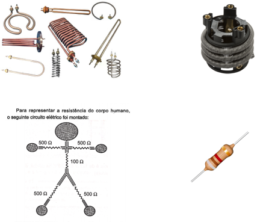
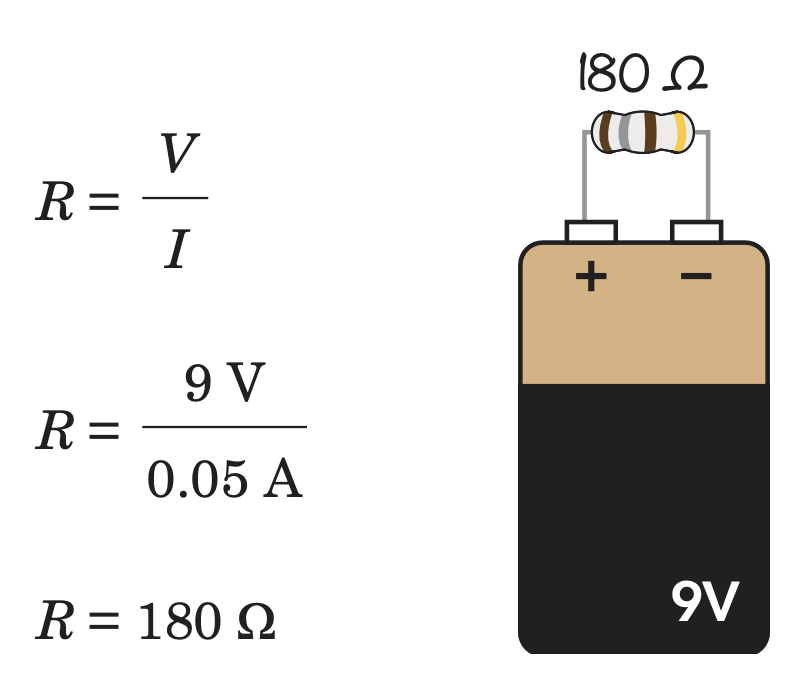
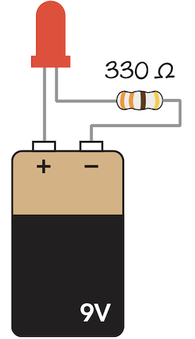

# Explorando micro universo dos eletróns

## Componentes
* Resistor
* Captacitor
* Transitor
* Diodo
* LED
* LDR
* Porta Lógica

## Resistência
- Ato ou efeito de resistir.
- Propriedade de um corpo que reage contra a ação de outro corpo.
- É a capacidade física de um corpo qualquer se opor à passagem de corrente elétrica mesmo quando existe uma diferença de potencial aplicada.



### Primeira Lei de Ohm's
Formula usada para controlar a corrente e tensão no circuito.

```
V = I x R

Onde:
V = tensão, media em Volts (V)
I = corrente, medida em Ampere (A)
R = resistência, medida em Ohms (Ω)
```

É possível escrever também de duas outras maneiras:

```
R = V / I

ou

I = V / R

```



### Bricando com LED
É LED é um circuito que sempre deve ter uma resistor acoplado em série com ele. A maioria dos LED precisa de uma tensão de 2v e 20mA (ou 0,02A) para acender. Usamos uma formula simples para calcular a resistência necessário com base na fonte de energia:

```
R = V(bat) - V(led) / I (led)
```

```
Dado que: 

Bateria -> 9v
LED -> 2v

Então:

R = ( 9v - 2v ) / 20 mA
R = 7v / 20mA
R = 0,35 * 1000
R = 350 Ω
```




