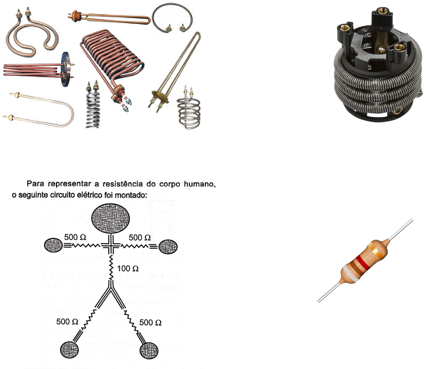
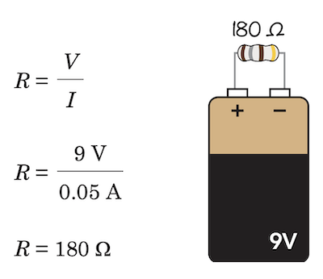

# Explorando micro universo dos eletróns

## Componentes
* Resistor
* Captacitor
* Transitor
* Diodo
* LED
* LDR
* Porta Lógica

## Resistência
- Ato ou efeito de resistir.
- Propriedade de um corpo que reage contra a ação de outro corpo.
- É a capacidade física de um corpo qualquer se opor à passagem de corrente elétrica mesmo quando existe uma diferença de potencial aplicada.



### Primeira Lei de Ohm's
Formula usada para controlar a corrente e tensão no circuito.

```
V = I x R

Onde:
V = tensão, media em Volts (V)
I = corrente, medida em Ampere (A)
R = resistência, medida em Ohms (Ω)
```

É possível escrever também de duas outras maneiras:

```
R = V / I

ou

I = V / R

```


